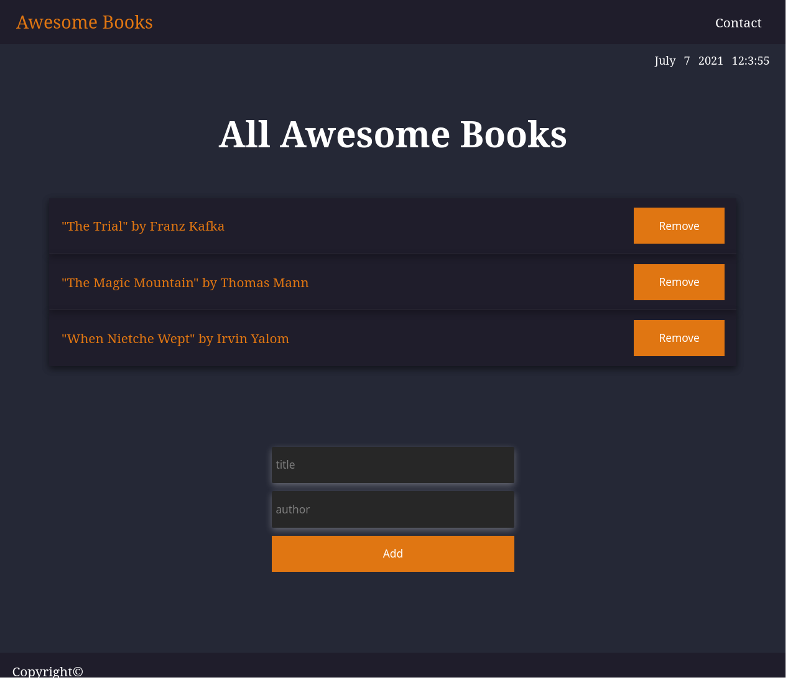

# Books Project One

> In this project, you can create your  own virtual bookshelf.
You can also remove books,if you dont like it,right?

This project is a project for books list.

## Built With

- HTML
- CSS
- SCSS
- JavaScript

## Live Demo

[live-demo](https://vladanvi99.github.io/books-collection-project-one/) 

## Authors

👤 **Author1**

- GitHub: [@githubhandle](https://github.com/vladanvi99)
- Twitter: [@twitterhandle](https://twitter.com/vladanvi99)
- LinkedIn: [LinkedIn](https://www.linkedin.com/in/vladan-videnovi%C4%87-780bb11b2/)

👤 **Author2**

- GitHub: [@githubhandle](https://github.com/SimonGrchevski)
- LinkedIn: [LinkedIn](https://www.linkedin.com/in/simon-grchevski-682935209/)

## 🤝 Contributing

Contributions, issues, and feature requests are welcome!

Feel free to check the [issues page](../../issues/).

## Show your support

Give a ⭐️ if you like this project!

